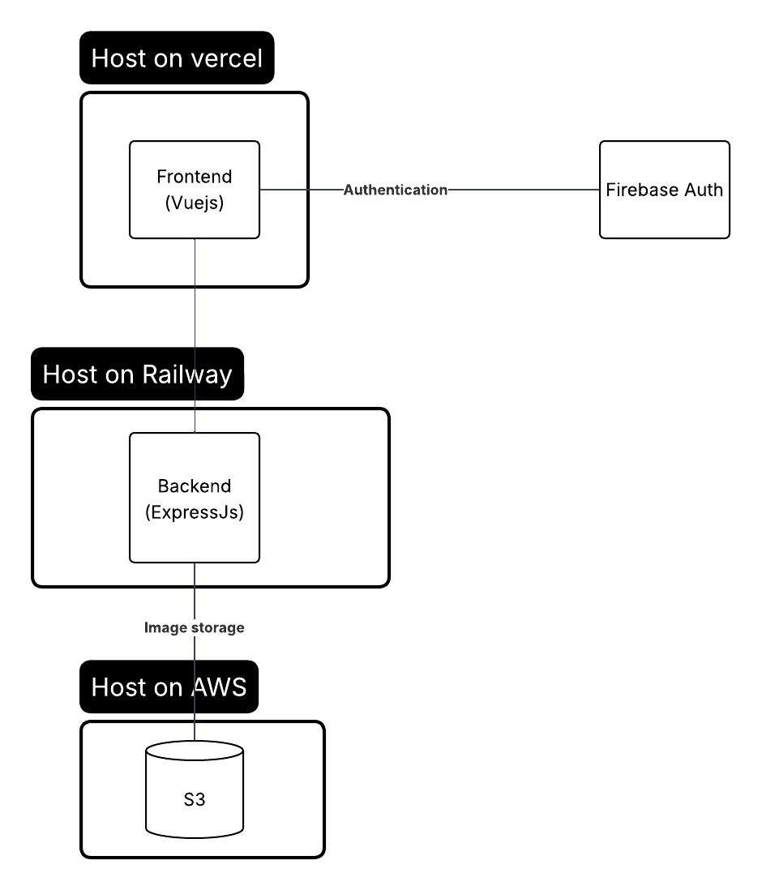

# Kinobi Image Upload Application

## Live Demo

https://kinobi-upload-app.vercel.app/

## Architecture




A modern, responsive web application for uploading and managing images, built with Nuxt.js, Vuetify, and Firebase Authentication.

## Features

### 🔐 Authentication
- **Google OAuth Integration**: Secure sign-in using Firebase Authentication
- **Session Management**: Persistent user sessions with automatic token refresh
- **Protected Routes**: Upload functionality requires authentication

### 📸 Image Upload
- **Drag & Drop Interface**: Intuitive file upload with visual feedback
- **Multiple File Formats**: Support for JPG, PNG, and GIF images
- **File Validation**: Automatic validation of file type and size (max 5MB)
- **Progress Tracking**: Real-time upload progress with visual indicators
- **Cloud Storage**: Secure uploads to AWS S3 via presigned URLs

### 🖼️ Image Management
- **Gallery View**: Grid layout displaying all uploaded images
- **Image Preview**: Full-size image viewing in modal dialogs
- **Sorting Options**: Sort by date (newest/oldest) or name (A-Z/Z-A)
- **Upload Metadata**: Display upload timestamps and file information
- **URL Copying**: Easy sharing with one-click URL copying to clipboard

### 🎨 Modern UI/UX
- **Material Design**: Clean, intuitive interface using Vuetify components
- **Responsive Layout**: Works seamlessly on desktop, tablet, and mobile devices
- **Loading States**: Skeleton loaders and progress indicators for better UX
- **Error Handling**: User-friendly error messages and alerts

## Tech Stack

- **Framework**: Nuxt.js 2.15.7 (Vue.js-based)
- **UI Library**: Vuetify 2.5.5 (Material Design)
- **Authentication**: Firebase 8.0.0 (Google OAuth)
- **Storage**: AWS S3 (via backend API)
- **Language**: TypeScript support
- **State Management**: Vuex store for authentication state

## Prerequisites

- Node.js (v14 or higher)
- Yarn package manager
- Firebase project with Google Authentication enabled
- Backend API for S3 presigned URL generation

## Environment Setup

Copy .env.example to .env and fill in the value

## Installation & Development

```bash
# Install dependencies
$ yarn install

# Serve with hot reload at localhost:3000
$ yarn dev

# Build for production and launch server
$ yarn build
$ yarn start

# Generate static project
$ yarn generate

# Deploy (build + generate)
$ yarn deploy
```

## Project Structure

```
frontend_kinobi/
├── components/          # Reusable Vue components
├── composables/         # Vue composables for shared logic
│   └── useFirebaseAuth.ts
├── layouts/            # Application layouts
├── pages/              # Route pages
│   ├── index.vue       # Home page with auth status
│   ├── login.vue       # Authentication page
│   └── upload.vue      # Image upload interface
├── plugins/            # Nuxt plugins
│   ├── auth.client.ts  # Authentication initialization
│   └── firebase.client.ts # Firebase configuration
├── store/              # Vuex store modules
│   └── auth.js         # Authentication state management
└── nuxt.config.js      # Nuxt configuration
```

## API Integration

The application communicates with a backend API for:

- **Presigned URL Generation**: `POST /get-presigned-url`
  ```json
  {
    "fileName": "image.jpg",
    "fileType": "image/jpeg"
  }
  ```

- **File Listing**: `GET /list-files`
  - Returns array of uploaded image objects with `url` and `key` properties

All API requests include Firebase authentication tokens in the `Authorization` header.

## Firebase Configuration

1. Create a Firebase project at [Firebase Console](https://console.firebase.google.com)
2. Enable Google Authentication in Authentication > Sign-in method
3. Add your domain to authorized domains
4. Configure Firebase SDK in `plugins/firebase.client.ts`

## Development Notes

- Authentication state is managed globally via Vuex store
- Firebase auth state listener automatically syncs user sessions
- Image uploads use presigned URLs for direct S3 upload
- Responsive design adapts to different screen sizes
- TypeScript support for better development experience

## Contributing

1. Fork the repository
2. Create a feature branch (`git checkout -b feature/amazing-feature`)
3. Commit your changes (`git commit -m 'Add some amazing feature'`)
4. Push to the branch (`git push origin feature/amazing-feature`)
5. Open a Pull Requestx

## License

This project is part of the Kinobi technical assessment.
